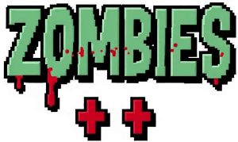
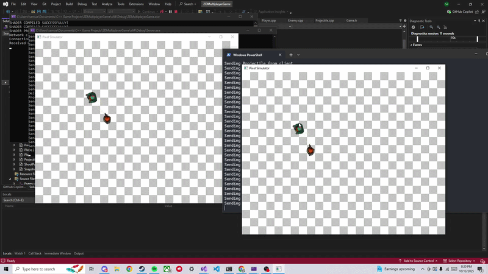

<div align="center">
  

  <p><strong>A top-down multiplayer zombie shooter written in modern C++.</strong></p>

  
</div>

---

Zombies++ is a client/server LAN game built from scratch on a custom OpenGL renderer and an
ENet (UDP) networking layer. One player hosts a match (which spins up a dedicated server
process), other players join over the network, and everyone fights off waves of zombies in a
shared, server-authoritative world.

> ⚠️ This is a hobby/learning project and a work in progress. It currently targets **Windows + Visual Studio 2022** only.

## Features

- **Client/server multiplayer** over ENet (UDP) on the LAN — one click to host, join others by IP.
- **Server-authoritative simulation** with **client-side interpolation** (snapshots are rendered a few ticks in the past and lerped) for smooth movement.
- **Custom OpenGL 2D renderer** (GLFW + GLAD) drawing textured sprites, with a scrolling tile world and a player-following camera.
- **Dear ImGui** menus — main menu (Host / Join), and an in-game settings panel (toggle enemy spawning, wireframe, quit).
- Zombies that spawn from the screen edges and chase players; projectiles you fire with the mouse.

## Tech stack

| Area | Library |
|------|---------|
| Windowing / input | [GLFW](https://www.glfw.org/) |
| OpenGL loader | [GLAD](https://glad.dav1d.de/) |
| Math | [GLM](https://github.com/g-truc/glm) |
| Networking | [ENet](http://enet.bespin.org/) (UDP) |
| UI | [Dear ImGui](https://github.com/ocornut/imgui) |
| Image loading | [stb_image](https://github.com/nothings/stb) |

All third-party headers are vendored under `include/`, and prebuilt libs live in `lib/`.

## Project layout

```
Zombies++.sln          Visual Studio solution (3 projects)
├── Core/              Static library: shared game logic + network wire format
│   └── src/           GameObject/Player/Enemy/Projectile, Game singleton, packet structs
├── Server/            Headless authoritative simulation (links Core.lib)
├── Client/            OpenGL/GLFW/ImGui game client (links Core.lib)
│   ├── src/           Renderer, Camera, Window, TileWorld, UIManager, Network
│   └── resources/     Textures and the logo
├── include/           Vendored third-party headers (enet, glm, glad, GLFW, stb, KHR)
└── lib/               Prebuilt static libs (Core.lib, enet64.lib, glfw3.lib)
```

The **Core** project is a static library shared by both the **Client** and the **Server**, so the
two sides agree on game objects and the packet format.

## Building

**Requirements:** Windows, Visual Studio 2022 (Desktop development with C++), C++17.

1. Clone the repo and open `Zombies++.sln` in Visual Studio 2022.
2. Select the **`x64`** platform configuration. > ⚠️ x64 only — the bundled `enet64.lib` / `glfw3.lib` are 64-bit, so the Win32 configurations will not link.
3. Build the solution (**Build → Build Solution**, or `Ctrl+Shift+B`).

Build order is handled automatically: `Core` compiles to `lib/Core.lib`, then `Client.exe` and
`Server.exe` are produced in `x64/Debug/`.

<details>
<summary>Building from the command line</summary>

```powershell
msbuild Zombies++.sln /p:Configuration=Debug /p:Platform=x64
```
</details>

## Playing

You don't launch the server yourself — the client does it for you.

- **Host a game:** launch `Client.exe` and click **Host**. The client starts a `Server.exe` process
  (it listens on UDP port **6969**) and connects to it over loopback.
- **Join a game:** launch `Client.exe`, type the host's LAN IP into the **IP Address** box, and click **Join**.

To let other machines join, make sure the host's UDP port **6969** is allowed through the firewall.

### Controls

| Input | Action |
|-------|--------|
| `W` `A` `S` `D` | Move |
| Left mouse button | Shoot |
| `Esc` | Toggle the settings menu |

From the settings menu you can toggle **Spawn Enemies** (server-side zombie spawning), **Wire Frame**
rendering, and **Quit**.

## Notes & caveats

- Designed for LAN play; there's no matchmaking, accounts, or NAT traversal.
- The repo intentionally checks in the vendored `include/` headers and prebuilt `lib/` static libraries so it builds without a package manager.
- Code style is enforced by the committed `.clang-format` (Visual Studio "Microsoft" style, tab-indented) — in VS use `Ctrl+K, Ctrl+D` to format a file.
